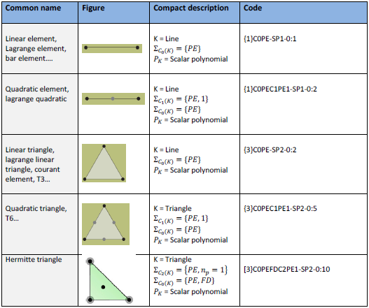
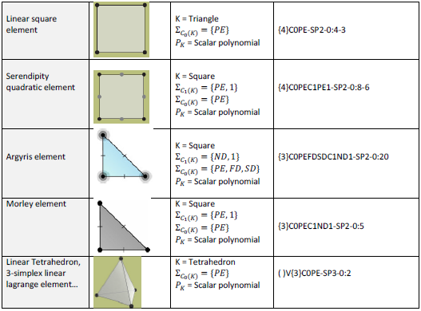

KFE
===============
KFE is a library generating symbolic finite elements following a simple specification.

Examples of finite elements described by the specification are presented in the table below.

The program currently only supports only 2D finite elements for point-based evaluation

and generate symbolic stiffness matrices for 1D elements in 1D, 2D and 3D.

FEmaths
----------------
The finite element mathematics is the

A finite element is described by a triplet:

 * Geometry
 * Functional requirements
 * Function (polynomial or vector polynomials)

and represented by the following SysML diagram.

.. image:: img/syml_diagram.PNG

FEmaths example
----------------

