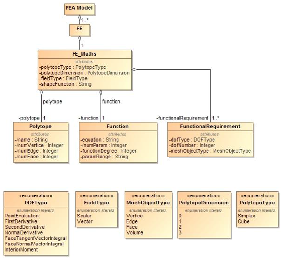
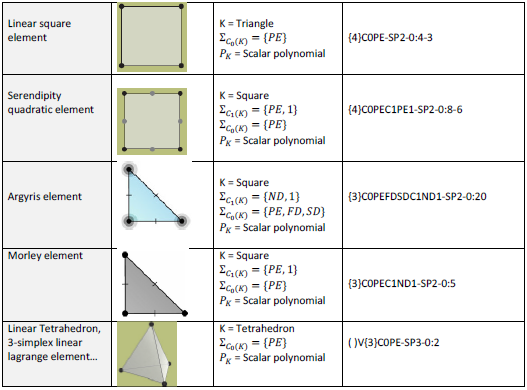

KFE is a library generating symbolic finite elements following a specification presented at the

NAFEMS americas conference in June 2016 (https://www.nafems.org/2016/americas/agenda/) .

`NAFEMS presentation <NAFEMS_presentation.pdf>`_

Examples of finite elements described by the specification are presented in the table below.

The program currently only supports only 2D finite elements for point-based evaluation

and generate symbolic stiffness matrices for 1D elements in 1D, 2D and 3D.

FEmaths (finite element mathematics)
----------------

Finite element mathematics can be described by a triplet as follows:

 * Geometry
 * Functional requirements
 * Function (scalar polynomials or vector polynomials)

and represented by the following SysML diagram.

SysML diagram
----------------

FEmaths example
----------------

.. image:: img/examples_femaths_1.PNG

